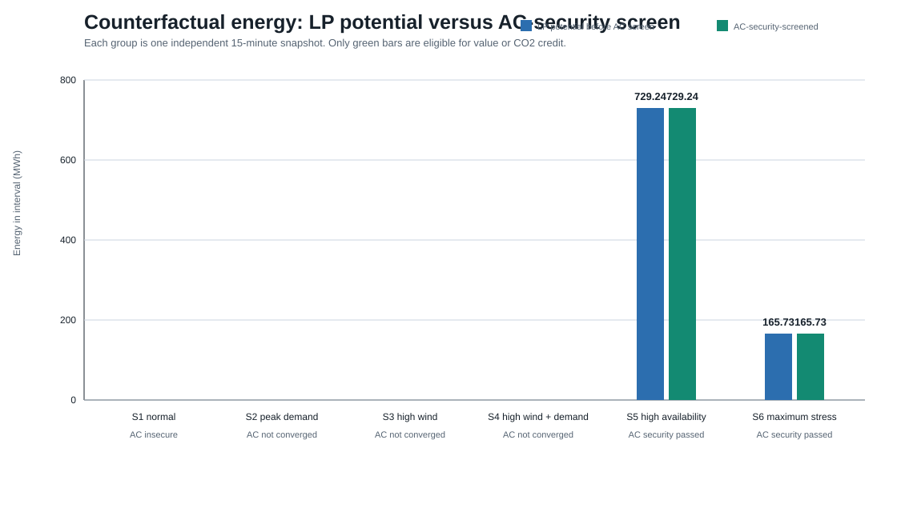

# Ireland Wind Grid Optimiser

> A transparent research prototype for studying wind dispatch-down in a stylised representation of the Irish transmission network. It combines quarter-hourly EirGrid observations, horizon-specific wind forecasts, linear wind-acceptance optimisation, and nonlinear AC-security screening.

## Project snapshot

| Question | Evidence in this release |
|---|---|
| **What is being studied?** | Whether a forecast-informed optimiser could identify additional wind acceptance in selected, stylised Irish-network snapshots. |
| **How is it tested?** | Candidate linear-programme dispatches are screened with nonlinear AC power flow against configured voltage, line-loading, and transformer-loading criteria. |
| **What is the key result?** | Only 2 of 6 selected snapshots pass the AC-security gate. Their combined eligible result is **894.97 MWh**. |
| **What does that result mean?** | It is a selected-snapshot research result—not an annual saving, market forecast, operational recommendation, or estimate of historical EirGrid decisions. |
| **How is it checked?** | The release includes pinned dependencies, source-input hashes, a synthetic end-to-end fixture, and a 116-test automated suite. |



## Why this matters for Ireland

Ireland's transition to a low-carbon electricity system depends on integrating variable renewable generation while maintaining a secure network. This project is a cautious, reproducible way to explore that challenge using public observations and clearly stated modelling assumptions. It is designed to support learning and research discussion; it does **not** model confidential system topology, operational control actions, or investment decisions.

## Research question

> How much observed wind dispatch-down could a forecast-informed optimiser reduce in a stylised Irish network after every candidate dispatch is screened against configured nonlinear AC voltage and thermal criteria?

## Research design

```text
Quarter-hourly EirGrid observations
          |
          +-- Forecasting evaluation
          |      +-- horizon-specific wind forecasts
          |
          +-- Operating-scenario selection
                         |
                         v
            Linear wind-acceptance optimisation
                         |
                         v
                  LP candidate dispatch
                         |
                         v
              Nonlinear AC-security screening
                    |                    |
                    v                    v
       security-screened result   diagnostic / sensitivity analysis
```

The linear programme proposes a candidate dispatch using linearised network constraints. It becomes a reportable result only after the PyPSA AC power-flow screen converges and passes all configured security criteria. Non-converged, nonphysical, incomplete, or insecure cases receive **zero** energy, value, and emissions credit.

## Author contribution

I developed this project as an independent research prototype, bringing together data preparation, chronological wind-forecast evaluation, linear optimisation, AC-security screening, reproducibility checks, and research documentation. My aim was to make each claim traceable to released code, data records, assumptions, and explicitly stated limitations.

## Scope and evidence

This release contains:

- A stylised 58-bus, 65-line, 5-transformer transmission-network representation.
- Six independent 15-minute operating snapshots.
- Forecasting experiments using persistence, linear-regression, feature-engineered, and direct multi-horizon models.
- A linear optimiser that maximises accepted wind within its configured constraints.
- Nonlinear AC screening of voltage, line loading, and transformer loading.
- A security-gated counterfactual calculation for energy, indicative value, and indicative emissions.

The forecasting evaluation uses 20,348 quarter-hourly observations from 1 January to 31 July 2026. It uses five expanding chronological validation windows, no random shuffling, and lagged or rolling features available only at the forecast issue time. These are retrospective forecasts; the repository does not claim to reproduce the operational forecasts available to EirGrid dispatchers in real time.

## Key results

[`data/processed/counterfactual_analysis.csv`](data/processed/counterfactual_analysis.csv) is the authoritative release output.

| Scenario | AC status | Security-screened energy |
|---|---|---:|
| S1 — Normal | Converged but AC-insecure | 0 MWh |
| S2 — Peak demand | Not converged / non-creditable | 0 MWh |
| S3 — High wind | Not converged / non-creditable | 0 MWh |
| S4 — High wind, high demand | Not converged / non-creditable | 0 MWh |
| S5 — High availability, low generation | AC-security passed | 729.2375 MWh |
| S6 — Maximum stress | AC-security passed | 165.7325 MWh |
| **Selected-snapshot aggregate** | **Security-screened only** | **894.97 MWh** |

Under the explicitly illustrative assumptions of EUR50/MWh and 0.4 tCO2/MWh, the two secure snapshots correspond to EUR44,748.50 of indicative value and 357.988 tCO2 of indicative emissions sensitivity. They are not measured market revenue, avoided emissions, or evidence of a change to real operator dispatch.

## Reproduce the release

Use Python 3.12 and a clean environment:

```powershell
py -3.12 -m venv .venv
.\.venv\Scripts\Activate.ps1
python -m pip install --upgrade pip
python -m pip install -r requirements.txt
```

### Quick, data-free check

The following commands work without redistributing EirGrid source workbooks:

```powershell
python scripts/reproducibility/verify_release_artifacts.py
python scripts/reproducibility/run_synthetic_fixture.py
```

The first command checks release artifacts, available manifest hashes, AC-security classification consistency, and SVG validity. The second runs a self-contained forecast-to-optimisation-to-security-gate smoke test using synthetic data.

### Full data-backed validation

The raw source workbooks are intentionally excluded from Git. Obtain and use them only in accordance with their source terms, then place the files listed in [`data_manifest.csv`](data_manifest.csv) under `data/raw/`.

```powershell
python scripts/reproducibility/verify_release_artifacts.py --require-source-inputs
python -m pytest scripts tests
python scripts/release/generate_release_figures.py
```

The maintained suite contains 116 tests and passed in the reference Python 3.12 environment. The full suite requires the EirGrid workbook; use the synthetic fixture when those source inputs are unavailable.

## Read the project

- [`docs/FORECASTING_PROTOCOL.md`](docs/FORECASTING_PROTOCOL.md) — data timing, feature construction, and chronological validation protocol.
- [`docs/S2_ASSESSMENT.md`](docs/S2_ASSESSMENT.md) — why S2 is retained as a diagnostic rather than a secure-benefit claim.
- [`data_manifest.csv`](data_manifest.csv) — input provenance, SHA-256 hashes, and redistribution notes.
- [`reports/figures/`](reports/figures/) — reproducible release figures.
- [`scripts/validation/ac_validator.py`](scripts/validation/ac_validator.py) — shared AC-security gate.

## Interpretation and limitations

- The network is a research representation, not the operational Irish transmission system.
- The LP uses a linearised formulation; AC power flow is a post-optimisation security screen, not a full AC optimal-power-flow model.
- The AC screen covers configured steady-state voltage and thermal criteria only. It does not cover dynamic stability, inertia, reserves, outages, protection, voltage-control schemes, market rules, or operator actions.
- The six scenarios are independent snapshots, not a chronological simulation.
- Forecast validation is retrospective and cannot establish operational forecast availability.
- Monetary and emissions quantities are assumption-driven sensitivities.
- Reactive-support and reinforcement analyses are exploratory diagnostics, not device-sizing or investment recommendations.

## Data, licence, and responsible reuse

The code and original documentation are released under the [MIT License](LICENSE). External data remain subject to their own licences and terms. Re-download EirGrid workbooks from the [official system and renewable-data reports page](https://www.eirgrid.ie/grid/system-and-renewable-data-reports) and confirm current reuse conditions before publishing derivative data.

The supplied geospatial extracts are documented in [`data_manifest.csv`](data_manifest.csv). Some lack recorded acquisition provenance and must not be presented as verified or redistributable source data.

## Release boundary

This repository supports the documented reproducibility scripts and maintained tests above. Historical diagnostic scripts are retained for traceability, but they are not the supported public release workflow and may rely on local historical inputs.
